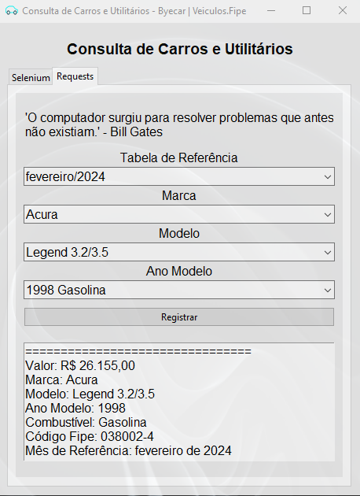
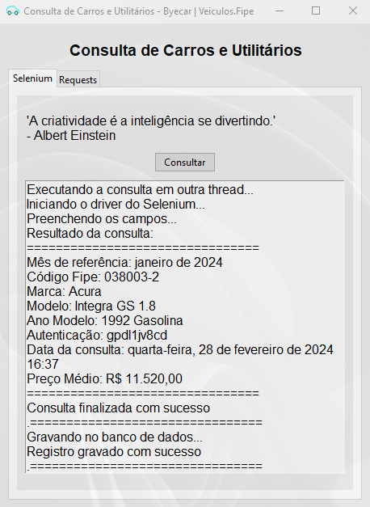

# 🚗 Consulta de Carros e Utilitários - Byecar | Veiculos.Fipe


👤 **Leonardo Carlos da Silva Dias**

🌐 [Portfólio](https://leocarlos-dias.github.io/personal-portfolio/)  
🔗 [LinkedIn](https://www.linkedin.com/in/leonardocsdias/)

## 📖 Sobre

O Consulta de Carros e Utilitários - Byecar | Veiculos.Fipe é um aplicativo que permite consultar informações sobre carros e utilitários na Fipe. O aplicativo oferece duas maneiras de fazer a consulta além de permitir que o usuário salve as informações consultadas em um banco de dados MySQL.

## 🚀 Tecnologias Utilizadas

- Python
- Selenium
- Requests
- MySQL
- Tkinter
- Git & GitHub

## 📑 Índice

- [Funcionalidades](##funcionalidades)

## 📋 Funcionalidades

O aplicativo permite que o usuário consulte informações sobre carros e utilitários na Fipe de duas maneiras: **via navegador** e **via requisição HTTP**. Além disso, o usuário pode salvar as informações consultadas em um banco de dados MySQL.

### via Navegador

- O usuário pode consultar informações sobre carros na Fipe através do navegador. O aplicativo utiliza o Selenium para automatizar a navegação e a coleta de informações.

### via Requisição HTTP

- O usuário pode consultar informações sobre carros na Fipe através de requisições HTTP. O aplicativo utiliza o módulo `requests` para fazer as requisições e coletar as informações.

### Salvar Informações no Banco de Dados

- O usuário pode salvar as informações consultadas em um banco de dados MySQL. O aplicativo utiliza o módulo `mysql-connector-python` para se conectar ao banco de dados e salvar as informações.

## 📸 Screenshots




## 💻 Instalação e Execução

### Pré-requisitos

- [Python](https://www.python.org/downloads/)

### Clonando o repositório

```bash
git clone
```

opcionalmente, você pode criar um ambiente virtual para instalar as dependências do projeto.

```bash
## no Windows
python -m venv _venv

## no Linux ou macOS
python3 -m venv _venv
```

No caso de ter criado um ambiente virtual, ative-o.

```bash
## no Windows
_venv\Scripts\activate

## no Linux ou macOS
source _venv/bin/activate
```

### Instalando as dependências

```bash
## no Windows
pip install -r requirements.txt

## no Linux ou macOS
pip3 install -r requirements.txt
```

### Configurando as variáveis de ambiente

Crie um arquivo `.env` na raiz do projeto e adicione as seguintes variáveis de ambiente.

```env
DB_HOST=my_host || 144.126.222.30
DB_PORT=my_port || 4306
DB_DATABASE=my_database || laravel_docker
DB_USERNAME=my_username || user
DB_PASSWORD=my_password || user

Obs.: substitua os valores de acordo com as configurações do seu banco de dados. Os valores apresentados à direita são para facilitar o uso durante o teste do aplicativo, são os valores reais de desenvolvimento.
```

### Executando o aplicativo

```bash
## no Windows
python main.py

## no Linux ou macOS
python3 main.py
```

## 👀 Observações

- O aplicativo foi desenvolvido com pouco tempo e, por isso, pode conter bugs e falhas.
- O aplicativo foi desenvolvido com o intuito de praticar o uso do Selenium e do Tkinter.
- Quando realizo uma consulta, o aplicativo criará uma outra thread para realizar a consulta. Isso foi feito para que a interface do usuário não congele enquanto a consulta é realizada. Porém, isso pode causar problemas de concorrência e, por isso, o aplicativo pode apresentar falhas ao realizar consultas simultâneas.
- No momento da consulta dos 10 dados aleatórios, deve-se aguardar as 10 consultas antes de clicar no botão novamente. Caso contrário, o aplicativo pode apresentar falhas. Entretanto, pode usar a segunda aba para realizar consultas simultâneas.

## 💌 Contato

Em caso de dúvidas ou feedbacks, entre em contato por [email](mailto:leocsdias@hotmail.com).
